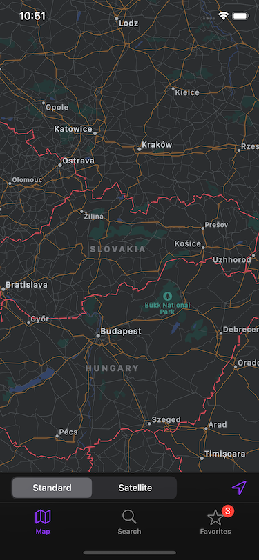
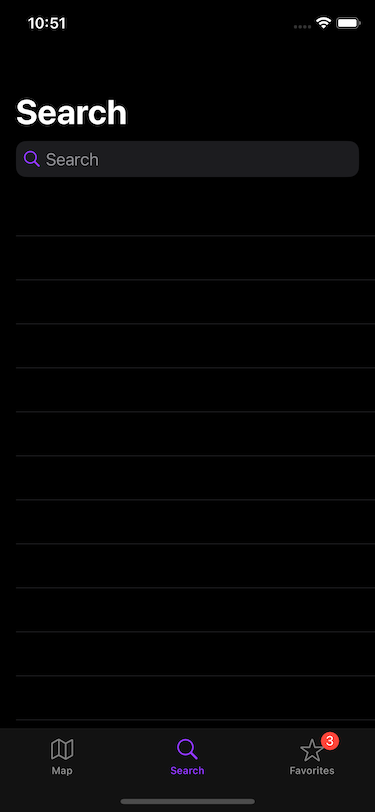
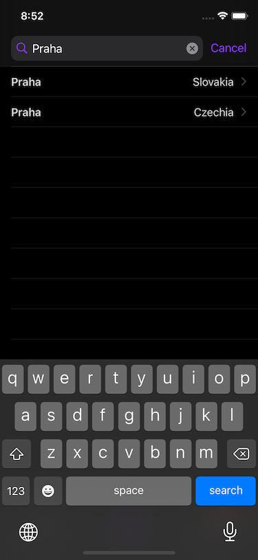
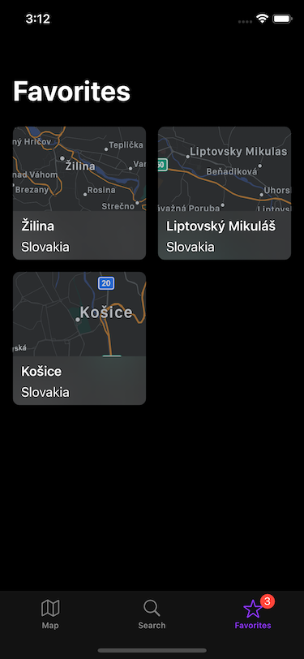
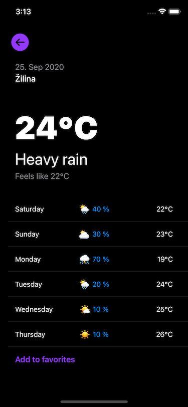
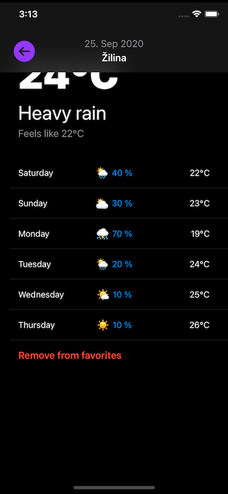

# ASSIGNMENT #

Create a weather forecast application that displays the current weather at the selected location. The application will use free to use and publicly available API. Get the necessary data from the API and then present it. The following specification is describing the appearance and functionality of the application.

## Technical requirements ##

### Programming ###

* Follow the basic principles of OOP
* Consistent and readable code
* Swift programming language
* The choice of architecture is on you
* Code must be compilable and without warnings
* We recommend you to choose [swift style guide](https://www.google.com/search?q=swift+style+guide)

### System and devices ###

* iOS 15 SDK
* Support for iOS 15 and higher
* All available iOS and iPadOS devices
* Functional on simulators and real devices

### Frameworks ###

* API parsing using Codable
* User interface using UIKit/SwiftUI
* Location services and (reverse)geocoding using CoreLocation
* Do not use any external libraries except those provided by the iOS SDK

### UI ###

* System font
* Use native icons from SF Symbols
* Responsive layout supporting all devices
* Localization of the application in Slovak and English

### API ###

* Get weather information from [OpenWeather](https://openweathermap.org/api)
* You can generate an API key after registration

## Handover ##

* Create a private fork of this repository
* Assign admin rights to andrej.jasso@goodrequest.com
* Create develop branch
* You can commit and push changes continuously
* Submit the final assignment as a pull request on the master branch
* Set andrej.jasso@goodrequest as reviewers

## Specification ##

The navigation of the application is divided via TabBar into 3 sections - Map, Search and Favorites. From each section, you can open a detail with the weather of the selected location.

### Map ###

The map shows the current location of the device.

At the bottom, it is possible to switch the map type and return (zoom) to the current position.

Using long-press it is possible to place a marker (pin) on the map with the selected location. The marker will contain the name of the location, obtained by reverse geocoding. 

Weather forecast detail for the given location will be displayed after selecting the pin.

### Search ###

 

Search screen allows a full-text location search using geocoding services.

Weather forecast detail for the given location will be displayed after selecting the location.

### Favorites ###

Favorites screen displays a list of locations that have been marked as favorite.

The favorites list will be stored even when the application is closed or restarted.

TabBar will show a badge with the number of favorite locations.

Weather forecast detail for the given location will be displayed after selecting the location.

### Detail ###

 

The detail screen will display the current weather at the selected location.

The screen also contains the weather forecast for the following days.

The location can be added/removed from favorites.

If the detail does not fit on the device screen, the top navigation will be displayed dynamically after scrolling down. 

BONUS: You can add transition animation while showing/hiding the top navigation.

## Styleguide ##

### Fonts ###

* System 14.0
* System 16.0
* System Semibold 16.0
* System 32.0
* System Black 64.0

### Colors ###

* White		#FFFFFF
* Gray		#8E8E93
* Black		#000000
* Blue		#0096FF
* Purple	#9437FF
* Red		#FF3B30

## Evaluation criteria ##

The evaluation will focus on:

* completeness of the solution in the specified time,
* project structure, the logical division into folders,
* code readability, following the chosen code style guide,
* handling of possible memory leaks and optional values,
* error and permission handling,
* implementation of selected architecture,
* versatility and scalability of the network part,
* data parsing and mapping,
* use of native UI elements and constraints,
* correct layout on various devices.
